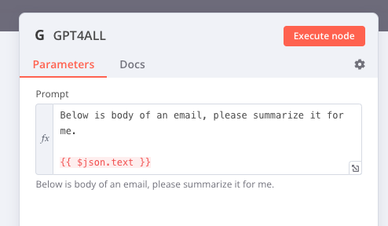

# n8n-nodes-gpt4all

This is an n8n community node. It lets you use self hosted [GPT4All](https://github.com/nomic-ai/gpt4all) in your n8n workflows.

GPT4ALL is a assistant like LLM based on Meta LLaMa.

[n8n](https://n8n.io/) is a [fair-code licensed](https://docs.n8n.io/reference/license/) workflow automation platform.

[Installation](#installation)  
[Operations](#operations)
[Compatibility](#compatibility)  
[Usage](#usage)
[Resources](#resources)

## Installation

Follow the [installation guide](https://docs.n8n.io/integrations/community-nodes/installation/) in the n8n community nodes documentation.

This node uses [GPT4All-ts](https://github.com/nomic-ai/gpt4all-ts) which by default, will download all necessary files on the first run. It basically downloads the `gpt4all` binary and the model (the size is roughly 4GB) if it doesn't found on `~/.nomic`. On docker, the path will be `/home/node/.nomic`, and it highly recommended to persist that directory as volume.

### ARM Based Deployment (Raspberry PI, Orange PI)

This extensions develop and test using an Orange PI 5 16GB memory, with SSD NVME 256 GB, running Armbian (debian based). The GPT4All doesn't have binary ready for linux with aarch64, and we need to compile it directly on the machine itself.

#### Compile GPT4All for Linux ARM64

Assuming you're on your docker container, run the following command for build the gpt4all binary. All the steps are taken from the [original repo](https://github.com/zanussbaum/gpt4all.cpp)

```bash
mkdir /home/node/.nomic
git clone https://github.com/zanussbaum/gpt4all.cpp.git

cd gpt4all.cpp
make

# There will be a binary called `chat`, move it to the /home/node/.nomic with name gpt4all

mv chat ../gpt4all
```

## Operations

GPT4All only expose one main operations: Prompt.

## Compatibility

The extension is develop and tested using n8n docker with tag 0.221.3-debian.

## Usage



## Resources

* [n8n community nodes documentation](https://docs.n8n.io/integrations/community-nodes/)
* [GPT4All Main Repo](https://github.com/nomic-ai/gpt4all)
* [llama.cpp](https://github.com/ggerganov/llama.cpp)


